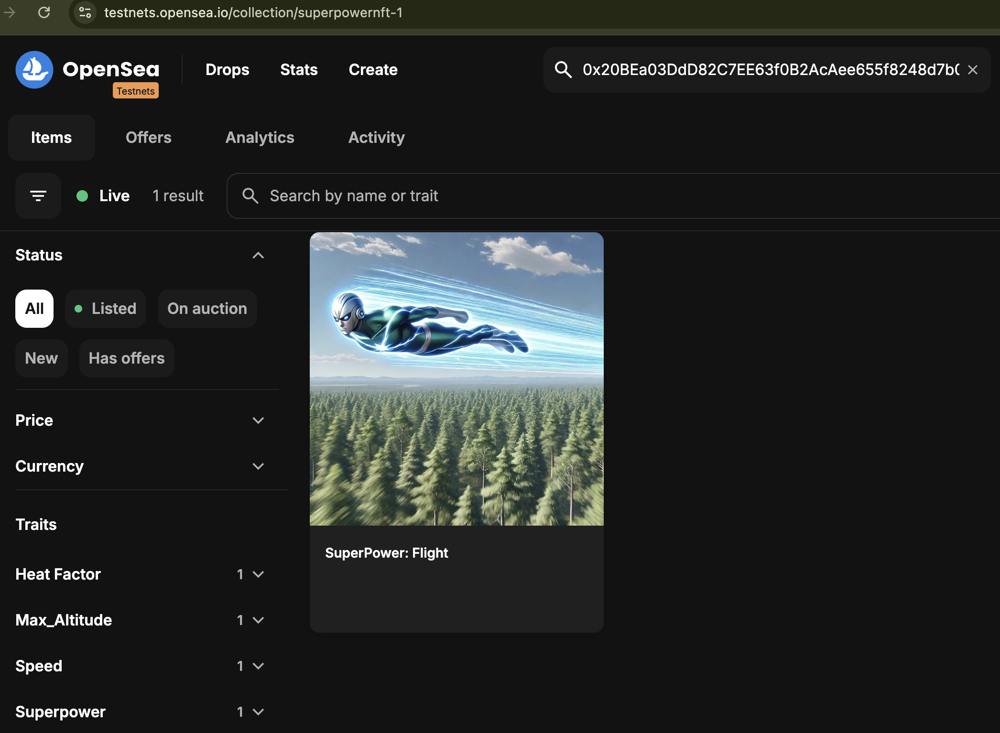

# Upgrading the Metadata with Etherscan

Now that the contract is deployed, we can in fact view it on OpenSea's testnet.&#x20;



The "Token ID" parameter will take you to the irys-created metadata page.&#x20;

<figure><figcaption></figcaption></figure>


1. **Create the new Metadata JSON and Upload It**

In your `metadata/` directory, create a file named `upgradedMetadata.json`:

```json
{
  "name": "SuperPower: Flight",
  "description": "This NFT grants the superpower of flight. The superpower's attributes can evolve over time.",
  "attributes": [
    {
      "trait_type": "Superpower",
      "value": "Flight"
    },
    {
      "trait_type": "Speed",
      "value": "900 mph"
    },
    {
      "trait_type": "Max_Altitude",
      "value": "100,000 ft"
    },
    {
      "trait_type": "Heat Factor",
      "value": "High"
    }
  ],
  "image": "https://gateway.irys.xyz/FN1_xwwb0x1d2j_94rEruHIi_4dGYRBfwSK93WtwbBA"
}

```

The steps to upload it are identical to the earlier metadata upload steps.


2. Upgrade the Metadata Using Etherscan

[Navigate to Sepolia's block explorer](https://sepolia.etherscan.io/address/0x20BEa03DdD82C7EE63f0B2AcAee655f8248d7b09#writeContract) and view the Code page and go to the "Write Contract" function. Enter in the new metadata location that was utilized before. This will now be the location where the new metadata is rendered

<figure><figcaption></figcaption></figure>

3. Voila! View Your New Metadata.

The example can be observed here: [https://sepolia.etherscan.io/address/0x20bea03ddd82c7ee63f0b2acaee655f8248d7b09](https://sepolia.etherscan.io/address/0x20bea03ddd82c7ee63f0b2acaee655f8248d7b09)

<figure><figcaption></figcaption></figure>
